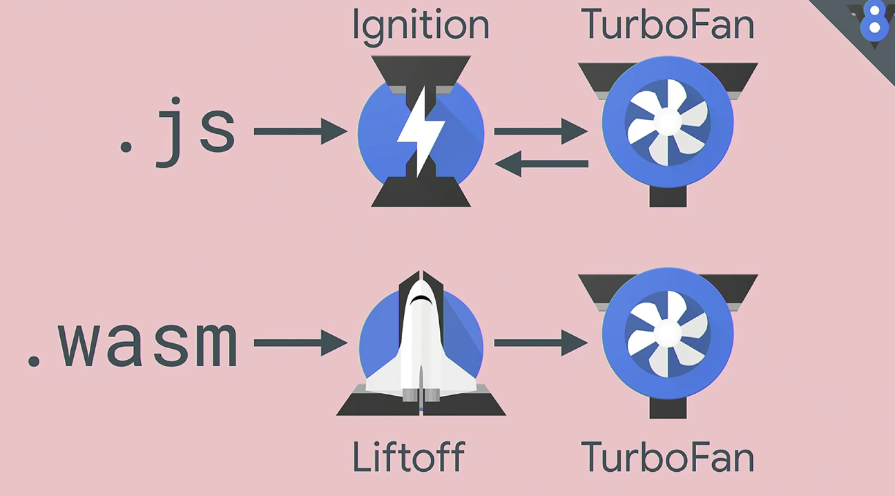
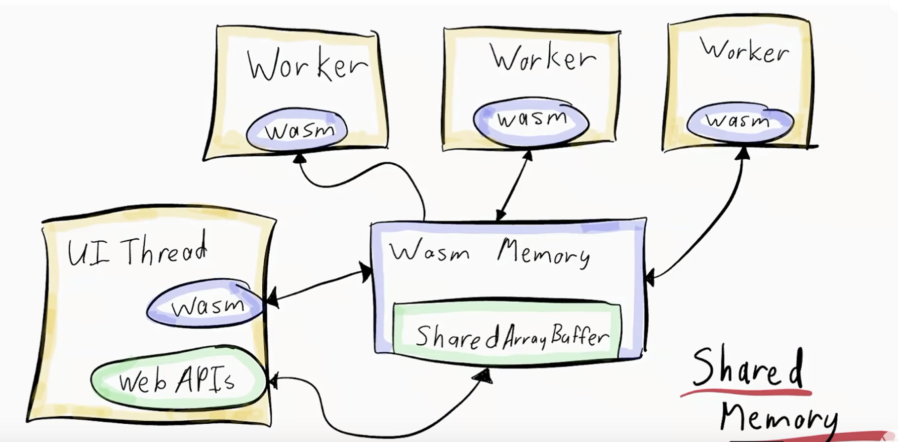
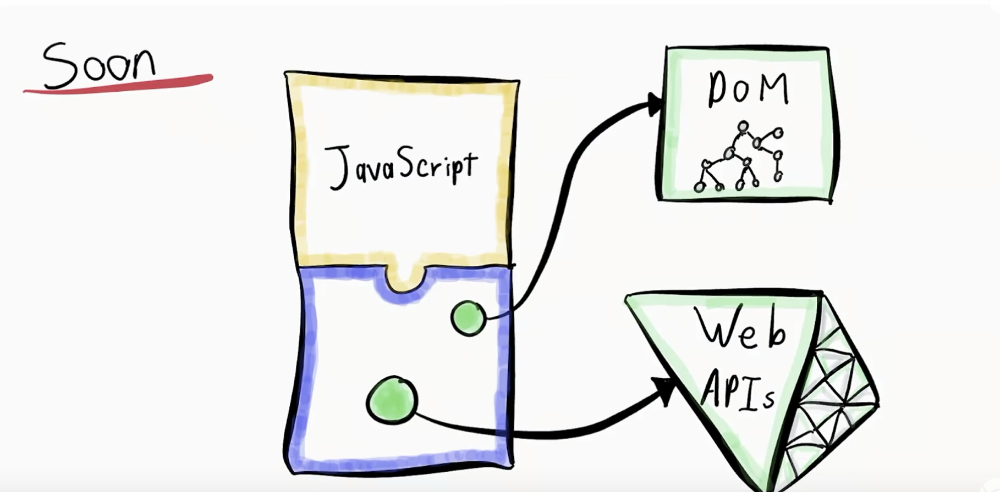
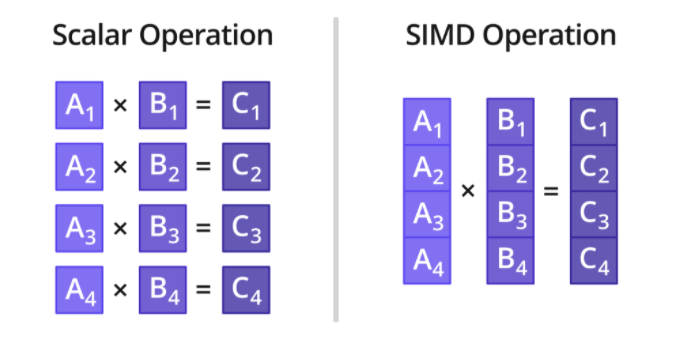

# wasm-notes

<!-- toc -->

- [Notes](#notes)
  * [WebAssembly for Web Developers (Google I/O '19)](#webassembly-for-web-developers-google-io-19)
    + [Basics](#basics)
    + [How did they do that?](#how-did-they-do-that)
    + [Ecosystems](#ecosystems)
    + [How do you convert C code to Javascript? How do you configure it?](#how-do-you-convert-c-code-to-javascript-how-do-you-configure-it)
    + [Takeaway 1](#takeaway-1)
    + [Performance](#performance)
    + [Compilation of javascript vs WASM on web](#compilation-of-javascript-vs-wasm-on-web)
    + [AssemblyScript?](#assemblyscript)
    + [Things to note](#things-to-note)
    + [Future of WASM](#future-of-wasm)
  * [Build the future of the web with WebAssembly and more (Google I/O '18)](#build-the-future-of-the-web-with-webassembly-and-more-google-io-18)
    + [How AutoCAD turned their desktop app into a web app with wasm](#how-autocad-turned-their-desktop-app-into-a-web-app-with-wasm)
    + [WASM is better than a web worker](#wasm-is-better-than-a-web-worker)
    + [Wasm entirely freed from going through javascript](#wasm-entirely-freed-from-going-through-javascript)
- [Resources](#resources)
  * [Watch lists](#watch-lists)
  * [Reading lists](#reading-lists)
    + [How-tos](#how-tos)
  * [Projects](#projects)
    + [Languages](#languages)

<!-- tocstop -->

# Notes

## [WebAssembly for Web Developers (Google I/O '19)](https://www.youtube.com/watch?v=njt-Qzw0mVY)
### Basics
- WebAssembly is NOT C++.
- Web stack based virtual machine. It is a processor that does not actually exist, but it helps compile real complex architectures.
- When you write code in whatever language, compile it to WebAssembly (through what is called emscripten), then code compiles to the instruction set of the target machine(x86, ARM, ...) in `wasm` format. 
- Virtual machine is designed to compile to real processors. So it can run on any runtimes. You are running the code on the bare metal (securely).
- Even AutoCAD now can runs on browser! Unity too. The browser has an ability to run all this. UI Toolkit QT also supports WebAssembly. 

### How did they do that?
- **emscripten**. It's a drop-in replacement for the C/C++ compilers. Instead compiling to machine code, it gives you WebAssembly. **Whatever code you wrote to run on a system should magically happen to run on the web too.** emscripten does a LOT. Origianlly it was the compiler of `asm.js` (another project that would compile C code into javascript to run programs faster). emscripten even pretends to use OpenGL by using WebGL and real file system by using virual things. You can run the code that was never made for the web!
- When WebAssembly came out, **emscripten just added a new output format but kept all the work for the emulation.** It was an accidental match with WebAssembly. It was so fit. There was no problem. Perhaps that's why C++ is so tightly involved with WebAssembly.

### Ecosystems
- Not for every topic, javascript ecosystem is big, while other languages' may be. 
- So you choose to either make yourself a javascript port if you don't find one in javscript, or resort to using other languages. 
- "Sqoosh". An image compression app written in javascript only. No server. Developers found that the ecosystem for image codecs and encoders was not so big in javascript, so they looked at C/C++. So? WebAssembly. They found some module in C++ and replaced it with the browser's encoder. Improvements were gained. 
- So now, ecosystems are not limited to a language anymore, with WebAssembly. **You can now take something that was not used for the web to use it for the web, through emscripten and WASM.**

### How do you convert C code to Javascript? How do you configure it?
1. Compiling the library
2. Define functions that you want to use in javascript (bridge functions)
3. Run `emcc` (emscripten C compiler)
4. Then you get `.cpp`, `.js`, and `wasm`. 
Note, because emscripten does a lot of job under the hood, always check the file size. 

### Takeaway 1
**If you have a gap in the web platform (javascript) that has been already filled many times in another language, WASM might be your tool!**

### Performance
- Javascript & WASM are both equally fast as of now.
- But it is easier for you to configure WASM to be faster (because it knows what to do, but you writing a javascript code may not know how you could optimize your code)
- WASM is looking into things like multiple threads and simd -- things javascript will never get access to. Then we can expect it to outperform javascript. 

### Compilation of javascript vs WASM on web
JS: JS file => Ignition (V8 intepretor) => TurboFan(optimizing compiler to generate machine code)
WASM: WASM file => Liftoff (WASM compiler) => TurboFan(optimizing code)

See the difference? 
1. Ignition is an **interpretor**, and WASM is a **compiler (generates machine code)**. On average, machine code would be faster. 
2. But one more thing: the machine code may have to fall back to interpretor (called de-optimization) because not always the machine code is right, for it is making certain assumptions. But it's not the case for WASM (much faster, never de-opted). 
3. It delievers faster and more **predictable** performance. This is important because sometimes javscript works at very different rates in different browsers!

### AssemblyScript?
- AssemblyScript is a Typescript to WASM compiler. You cannot just throw in the code into WASM because for ex, it does not have a DOM API.
- It uses a perfect Typescript syntax with a different type library! You don't have to learn a new language to write WASM. 
- For now, WASM does not have a built-in GC algo. You have to free the memory yourself. 

### Things to note
- Putting everything into WASM is not a good idea for now
- JS vs WASM are not opponents. They have things to complement eachother. Find the place where WASM fits in right!

### Future of WASM
These are current proposals.
1. Threads for parallel computation. Why? Many existing libraries in C/C++ work in multi-threads. Performance generally scales with multi-threads. Match on the web? There's Web Worker on the web! Currently stable. It has to formalize things a bit. Threads are shipped in Chrome 74 by default! 
2. Reference types. WASM can pass around arbitrary JS codes using the 'any' ref value type. WASM may run fundamental JS codes with this. 
3. WebIDL Binding proposal. It is used to define interfaces that are implemented on the web. 
4. GC, Exception handling, ....

See more at:
- https://www.youtube.com/watch?v=njt-Qzw0mVY
- https://webassembly.org/
- https://emscripten.org/

## [Build the future of the web with WebAssembly and more (Google I/O '18)](https://www.youtube.com/watch?v=BnYq7JapeDA)
### How AutoCAD turned their desktop app into a web app with wasm
- Of course, AutoCAD is better on Web because it's portable. 
- AC supports .dwg file type in desktop. 
- Before: Flash, HTML5/Javasript.... was not really scalable.  
- 2017: AC released a viewer that allows dwg files to be shown using emscripten.
- 2018: AutoCAD web app launched. Zero download, zero install. 
- They had C++ codebase, translated with emscripten, which gets compiled in the runtime on browser. UI: React & Typescript running together on the main thread. wasm modules: on web worker (separate thread). Interacting with the web app is just as smooth as the desktop app. 
- Implications: C++ developers never have to learn javascript to fix bugs.

### WASM is better than a web worker

- Web workers: can be quite heavy, and only work through `postMessage`. Limited.
- wasm: uses shared array buffer to communicate between workers at high speed. Existing C++ codebases that use multi-threading or blocking features can be directly ported to the web to take full advantage. 

### Wasm entirely freed from going through javascript

- wasm: it has to go through javacsript to have a reference to DOM. After: it won't be. 
- js module supports for wasm files will be supported as well.

## SIMD in WebAssembly
Fresh out of the oven, v8 released its support for wasm SIMD in late Jan, 2020.

### So what is SIMD? It:
- is a single Instruction, Multiple Data
- performs the same operation on multiple data elements
- can benefit audio/video codecs, image processors, real-time motion tracking in video, ... (which have many repetitive and costly ops like matrix product)
- essentially, is a dot product of two vectors
- directly uses the computer hardware - CPU. It uses set of instructions widely supported by majority of CPUs in the market. (e.g. Intel SIMD instruction extensions (called Streaming SIMD Extensions (SSE), which are set of instructions for x86 architectures) or NVIDIA GPU)
- can use up to 128 bits in wasm as of now

(pic from [wasmer's article](https://medium.com/wasmer/webassembly-and-simd-13badb9bf1a8))

### Why not SIMD in js but wasm?
- see https://github.com/tc39/ecmascript_simd. TC39 decided not to implement SIMD. Instead they give support for SIMD in wasm.

### Emscripten already can turn your code into something that uses SIMD
- with SIMD option enabled, it can automatically detect and put SIMD in the appropriate places.

See more at:
- https://v8.dev/features/simd
- https://github.com/tc39/ecmascript_simd
- https://github.com/WebAssembly/simd
- https://medium.com/wasmer/webassembly-and-simd-13badb9bf1a8
- https://course.ece.cmu.edu/~ece740/f13/lib/exe/fetch.php?media=seth-740-fall13-module5.1-simd-vector-gpu.pdf (technical)
- https://sites.cs.ucsb.edu/~tyang/class/240a17/slides/SIMD.pdf (technical)

# Resources
## Watch lists
- [WebAssembly for Web Developers (Google I/O '19)](https://www.youtube.com/watch?v=njt-Qzw0mVY)
- [Build the future of the web with WebAssembly and more (Google I/O '18)](https://www.youtube.com/watch?v=BnYq7JapeDA)
- [WebAssembly Extensions For Network Proxies, John Plevyak (from AutoDesk (CAD) team)](https://youtu.be/OIUPf8m7CGA)
- [The future of Webassembly (Lin Clark, Till Schneidereit, Mozilla)](https://www.youtube.com/watch?v=_gohblbI2Ds)

## Reading lists
### How-tos 
- [Emscripten and npm (How to integrate wasm module into a typical web application)](https://developers.google.com/web/updates/2019/01/emscripten-npm)
- [Extending the browser with WebAssembly (How to port the source code of a video codec into a browser)](https://developers.google.com/web/updates/2018/08/wasm-av1) [[Source code](https://github.com/GoogleChromeLabs/wasm-av1)]
- [How to compile C to wasm without emscripten](https://dassur.ma/things/c-to-webassembly/)
- [Making really tiny wasm graphics demos](http://cliffle.com/blog/bare-metal-wasm/)
- [How to do parcel + rust + wasm + three.js](https://github.com/cwervo/parc3l)
- [How to use rust modules for web development](https://medium.com/@atulanand94/using-rust-modules-for-javascript-web-development-part-i-e6dec27df7b2)
- [Pragmatic compiling of C++ to WebAssembly. A Guide](https://medium.com/@tdeniffel/pragmatic-compiling-from-c-to-webassembly-a-guide-a496cc5954b8)
- [Emscripting a C library to Wasm](https://developers.google.com/web/updates/2018/03/emscripting-a-c-library)
- [How to link c++ with javascript for wasm #1, with embind](https://emscripten.org/docs/porting/connecting_cpp_and_javascript/embind.html#embind )
- [How to link c++ with javascript for wasm #2, with webidl-binder](https://emscripten.org/docs/porting/connecting_cpp_and_javascript/WebIDL-Binder.html#webidl-binder)
- [How to use rust + wasm to visualize 3d data](https://users.rust-lang.org/t/point-cloud-visualizations/31394/6)
- [How to make a library in rust, compile it down to wasm](https://developer.mozilla.org/en-US/docs/WebAssembly/Rust_to_wasm)
- [How to make a minimal example of animating HTML5 canvas from C++ using SDL through WebAssembly](https://timhutton.github.io/sdl-canvas-wasm/)
- [How to do 3d + rust + webgl](http://www.chinedufn.com/3d-webgl-basic-water-tutorial/)

## Projects
### Languages
- [wasm studio](https://webassembly.studio/)
- [wasm homepage](https://webassembly.eu/)
- [wasm design](https://github.com/WebAssembly/design)
- [AssemblyScript: A strictly typed subset of Typescript that compiles down to wasm](https://github.com/AssemblyScript/assemblyscript)
- [Walt: a JavaScript-like syntax for WebAssembly text format](https://github.com/ballercat/walt)
- [Thinkscript: A low-level programming language inspired by TypeScript](https://github.com/evanw/thinscript)
- [Nectarjs: Javascript's God Mode (compilation target includes wasm)](https://github.com/NectarJS/nectarjs)
- [Rust bindings for Web/DOM APIs](https://github.com/rustwasm/wasm-bindgen)
